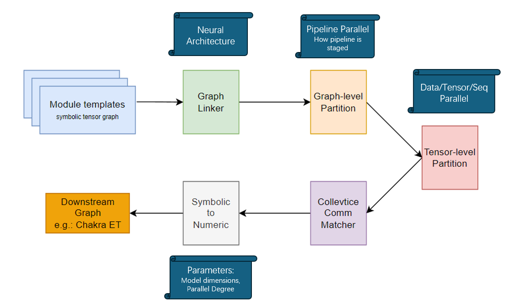

---

# Symbolic Tensor Graph (STG) Generator

**Author:** Changhai Man @ [SynergyLab](https://synergy.ece.gatech.edu/)    
**Contact:** cman8@gatech.edu

## Overview

The Symbolic Tensor Graph is a generator for [Chakra Execution Trace (ET)](https://github.com/mlcommons/chakra) files. This tool is designed to generate synthetic workload traces for use in parallel strategy exploration without gathering data from a real system or implementing actual workload codes. It supports various parallelization strategies like Data Parallelism (DP), Tensor Parallelism (TP), Pipeline Parallelism (PP) and Sequence Parallelism (SP).

### Key Features
- Generate synthetic transformer workloads in Chakra ET format.
- Supports multiple parallelism strategies (DP, TP, PP, SP).
- Support customized model dimensions for Transformer Models (batch, seq, dmodel, dff, n_head)

## Installation

To set up the environment and install the required dependencies, follow these steps:

```bash
# Clone the repository
git clone git@github.com:astra-sim/symbolic_tensor_graph.git

# Navigate to the project directory
cd symbolic_tensor_graph

# Install dependencies via conda
conda create -n <env_name>
conda activate <env_name>
conda install numpy sympy python-graphviz protobuf pandas -c conda-forge
```

## Usage

To generate symbolic workloads, use the following command:

```bash
python main.py –h
```

This will show all available options and their descriptions. Example of running the generator:

```bash
python main.py --output_dir generated/ \
               --output_name workload.%d.et \
               --comm_group_file comm_group.json \
               --dp 2 --tp 2 --pp 2 \
               --weight_sharded 0 
```

### Example Output:

```bash
$ ls generated/
comm_group.json  workload.0.et  workload.1.et  workload.2.et  workload.3.et
```

## Parameters

| Parameter                 | Description                         | Example Values           |
|---------------------------|-------------------------------------|--------------------------|
| `--output_dir`             | Folder to place output files        | `./output`               |
| `--output_name`            | Output file naming pattern          | `workload.%d.et`         |
| `--comm_group_file`        | Communication group config file     | `comm_group.json`        |
| `--chakra_schema_version`  | Chakra ET schema version            | `v0.0.4`, `v0.0.1`, `json`|
| `--dp`                     | Data parallelism degree             | `32`                     |
| `--tp`                     | Tensor parallelism degree           | `4`                      |
| `--pp`                     | Pipeline parallelism degree         | `2`                      |
| `--sp`                     | Sequence/Token parallelism degree   | `4`                      |
| `--weight_sharded`         | Shard weights (FSDP enabled)        | `True/False`             |
| `--din`                    | Input embedding size                | `51200`                  |
| `--dout`                   | Output embedding size               | `25600`                  |
| `--dmodel`                 | Model feature size                  | `25600`                  |
| `--dff`                    | FFN feature size                    | `25600*4`                |
| `--seq`                    | Sequence length                     | `1024`                   |
| `--head`                   | Number of attention heads           | `128`                    |
| `--num_stacks`             | Number of encoder stacks            | `32`                     |

\*: We do not specify number of total NPUs, which will be infered from the parallel degree as: ```num_NPUs=DP*TP*PP*SP```
## Example Commands

- **Generate with DP=8, TP=4, PP=4, no FSDP:**
  ```bash
  python main.py --output_dir generated/ --output_name workload_1.%d.et --comm_group_file comm_group_1.json --dp 8 --tp 4 --pp 4 --sp 1 --weight_sharded 0 --chakra_schema_version v0.0.4
  ```

- **Generate with DP=64, TP=1, PP=1, FSDP:**
  ```bash
  python main.py --output_dir generated/ --output_name workload_2.%d.et --comm_group_file comm_group_2.json --dp 64 --tp 1 --pp 1 --sp 1 --weight_sharded 1 --chakra_schema_version v0.0.4
  ```

- **Generate with DP=4, TP=4, PP=2, SP=2, FSDP, output in JSON format:**
  ```bash
  python main.py --output_dir generated/ --output_name workload_3.%d.json --comm_group_file comm_group_3.json --dp 4 --tp 4 --pp 2 --sp 2 --weight_sharded 1 --chakra_schema_version json
  ```


## Tool workflow
Here is a breif workflow about how stg generate traces step by step.


## Chakra Schema Version

The schema version used determines compatibility with different tools and repositories:
- **v0.0.4**: Current latest chakra version (by Oct.6 2024).
- **v0.0.1**: Supported for lagacy, not fully tested.

## License

MIT

---
